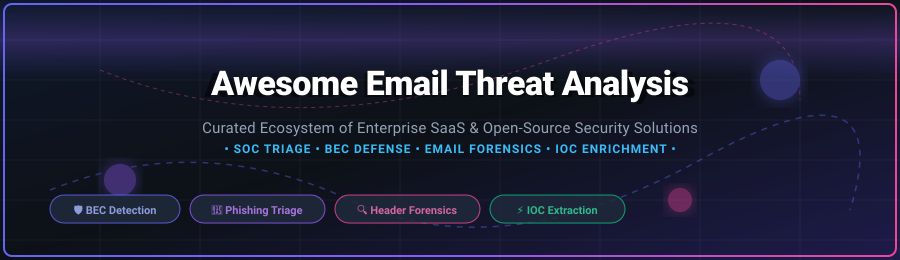

  
  
  
  
  
  

  

# 🛡️ Awesome Email Threat Analysis

> **A curated ecosystem of Enterprise SaaS platforms and Open-Source tools for Email Security, Phishing Triage, Business Email Compromise (BEC) Detection, IOC Extraction, and Email Forensics.**

---

## 📌 Executive Summary & Market Insights

Email remains the primary attack vector for modern cyber threats, spanning credential harvesting, Business Email Compromise (BEC), spear phishing, ransomware delivery, and account takeover (ATO). 

### 🌐 Market Size & Industry Dynamics
* **Estimated Market Size**: The global Email Security & Threat Analysis market is estimated at **$4.8 Billion (2026)** and is projected to reach **$10.2 Billion by 2030** (CAGR of ~13.5%).
* **Market Concentration**: The sector is **moderately fragmented**. Traditional Secure Email Gateways (SEGs) are increasingly giving way to Integrated Cloud Email Security (ICES) platforms that utilize API-based behavioral AI. While public tech giants and private equity-backed category leaders control significant market share, innovation from niche startups and active open-source security projects keeps the ecosystem dynamic.

---

## 📑 Table of Contents

- [🏢 SaaS & Enterprise Platforms](#-saas--enterprise-platforms)
- [🔓 Open-Source GitHub Projects](#-open-source-github-projects)
- [🤝 How to Contribute](#-how-to-contribute)
- [☕ Support & Sponsorship](#-support--sponsorship)
- [⚖️ Disclaimer](#-disclaimer)
- [📈 Star History](#-star-history)

---

## 🏢 SaaS & Enterprise Platforms

Below is a comparative breakdown of leading enterprise SaaS platforms for email security, phishing incident response, and automated threat triage.

> 💡 **Market Size Note:** Sector market size is estimated at ~$4.8B (2026), operating as a **moderately fragmented** market with rapid consolidation between API-first ICES solutions and traditional SEGs.

| Product | Focus & Core Capabilities | Company Size (Valuation / Revenue) 🔽 | Pricing (Starting Tier) | Free Tier / Free Trial Limits |
| :--- | :--- | :--- | :--- | :--- |
| **[Cloudflare Area 1](https://www.cloudflare.com/)** | Pre-delivery phishing protection, edge threat intelligence, and automated campaign blocking. | **$28.5B Market Cap** ($1.6B+ ARR) | $3.00 / user / month ($36.00 / user / year) | **30-Day Free Trial** (Full Phishing Risk Assessment across all organization mailboxes) |
| **[Check Point Avanan](https://www.checkpoint.com/)** | API-based cloud email security for M365 & Google Workspace with inline AI phishing defense. | **$20.2B Market Cap** ($2.5B+ ARR) | $3.10 / user / month ($37.20 / user / year) | **14-Day Free Trial** (Instant historical & live scan for up to 500 mailboxes) |
| **[Proofpoint Threat Response](https://www.proofpoint.com/)** | Enterprise automated incident response, threat intel correlation, and automated mailbox remediation. | **$12.3B Valuation** ($2.0B+ ARR) | $45.00 / user / year ($3.75 / user / month Essentials tier) | **30-Day Free Trial** (Proofpoint Essentials edition up to 50 mailboxes) |
| **[Mimecast Threat Center](https://www.mimecast.com/)** | Real-time threat dashboards, IOC feeds, email forensic analytics, and targeted threat protection. | **$5.8B Valuation** ($650M+ ARR) | $4.50 / user / month ($54.00 / user / year) | **30-Day Free Trial** (Full access to Threat Center & attachment sandboxing) |
| **[Darktrace Email](https://darktrace.com/)** | Self-learning AI detecting novel phishing, BEC, and impersonation without relying on signatures. | **$5.3B Valuation** ($620M+ ARR) | $30.00 / user / year ($2.50 / user / month) | **30-Day Proof of Value (POV)** (Passive mailbox audit & real-time threat report) |
| **[Abnormal Security](https://abnormalsecurity.com/)** | AI-native behavioral security baselining human communication patterns to halt advanced BEC. | **$5.1B Valuation** ($200M+ ARR) | $15.00 / user / year ($1.25 / user / month starting tier) | **14-Day Risk Assessment** (In-depth AI analysis of 90 days of historical email logs) |
| **[Barracuda Sentinel](https://www.barracuda.com/)** | AI-driven spear phishing defense, domain spoofing protection, and automated account takeover mitigation. | **$3.8B Valuation** ($500M+ ARR) | $2.85 / user / month ($34.20 / user / year) | **14-Day Free Trial** (Includes full Spear Phishing & Impersonation Audit) |
| **[Material Security](https://material.security/)** | BEC detection, account compromise defense, and sensitive data posture management. | **$1.1B Valuation** ($25M+ ARR) | $25.00 / user / year ($2.08 / user / month) | **14-Day Free Trial** (Guided security posture scan & risk evaluation) |
| **[Cofense Vision](https://cofense.com/)** | Phishing triage automation, human-reported threat ingestion, and fast cross-mailbox search. | **~$400M Valuation** ($100M+ ARR) | $2.50 / user / month ($30.00 / user / year) | **14-Day Free Trial** (Up to 250 users for phishing response assessment) |
| **[IRONSCALES](https://ironscales.com/)** | AI email security combining crowd-sourced threat intelligence with automated mailbox remediation. | **~$300M Valuation** ($40M+ ARR) | $2.50 / user / month ($30.00 / user / year) | **Free Forever Tier** (Up to 25 mailboxes) / **14-Day Trial** (500 mailboxes) |

---

## 🔓 Open-Source GitHub Projects

The open-source ecosystem provides essential frameworks for DFIR (Digital Forensics and Incident Response), self-hosted gateway filtering, header analysis, and phishing simulation. 

Below is the list of top open-source email security repositories, **sorted by GitHub Stars_Count (descending)**.

1. 🎯 **[GoPhish](https://github.com/gophish/gophish)** 
   * Open-source phishing framework designed for security awareness training, threat simulation, and testing organizational email security posture.

2. 🐝 **[TheHive](https://github.com/TheHive-Project/TheHive)** 
   * Scalable, open-source Security Incident Response Platform (SIRP) with dedicated email triage integration, analyst case tracking, and automated observable analysis.

3. 🧪 **[CAPEv2](https://github.com/kevoreilly/CAPEv2)** 
   * Automated malware analysis sandbox engine focused on extracting payload signatures and analyzing suspicious email attachments (DOCX macros, PDF exploits, archives).

4. ⚡ **[Rspamd](https://github.com/rspamd/rspamd)** 
   * High-performance, event-driven spam filtering system with multi-threaded architecture, SPF/DKIM/DMARC validation, neural network learning, and Redis backend.

5. 🛡️ **[SpamAssassin](https://github.com/apache/spamassassin)** 
   * The classic open-source anti-spam engine utilizing rule-based heuristic logic, Bayesian filtering, DNS blocklists, and MIME parsing.

6. 🔍 **[Suspicious](https://github.com/thalesgroup-cert/suspicious)** 
   * MIMEDefang-based automated email analysis tool designed to inspect raw email streams, extract attachments, decode headers, and report malicious indicators.

7. 📦 **[MailScanner](https://github.com/MailScanner/mailscanner)** 
   * Gateway email security framework designed for MTA protection (Sendmail, Postfix, Exim), integrating anti-virus engines and anti-spam controls.

8. 🔧 **[Defango](https://github.com/edoardottt/defango)** 
   * CLI utility and library written in Go for defanging and refanging IOCs (URLs, IP addresses, emails) during security investigation reports.

9. 🦅 **[Osprey](https://github.com/syne0/osprey)** 
   * PowerShell DFIR toolkit (forked from Hawk) tailored for investigating Microsoft 365 tenant intrusions, BEC compromises, and suspicious inbox rules.

10. 🔬 **[MXRay](https://github.com/cristianzsh/MXRay)** 
    * Open-source DFIR tool for parsing and analyzing email evidence (.eml, .msg, .pst, .mbox) specifically designed as a free alternative for BEC triage.

11. 👁️ **[Odin's Eye](https://github.com/Deon-Trevor/Odin-s-Eye)** 
    * Python-based email header analysis framework providing deep forensic insights into email routing, spoofing indicators, and authentication status.

12. 🛡️ **[PhishGuard v2](https://github.com/shivamgit20/PhishGuard-v2)** 
    * Fully client-side React phishing triage suite featuring MIME parsing, SPF/DKIM/DMARC forensic engines, threat scoring, and MITRE ATT&CK mapping.

13. 📊 **[Wireshark Phishing Playbook](https://github.com/yankywilson/wireshark-phishing-playbook)** 
    * Practitioner-grade playbook for investigating phishing network captures (PCAPs) using Wireshark and TShark, focusing on click links and C2 traffic.

14. 🌐 **[Scrollout F1](https://github.com/scrollout/f1)** 
    * Simple self-hosted security gateway proxy providing anti-spam and anti-virus filtering for email servers.

---

## 🤝 How to Contribute

Contributions from the cybersecurity community are warmly welcomed! 

1. **Fork** the repository on GitHub.
2. Create a feature branch (`git checkout -b feature/new-email-tool`).
3. Add or update tool listings in `README.md` following the established format.
4. Ensure SaaS tools include pricing details & free trial limits, and Open-Source repos include GitHub Stars_Badges.
5. Submit a **Pull Request** with a clear explanation of your additions.

Check out the [Awesome List Guidelines](https://github.com/ishandutta2007/Awesome-Awesome-Awesome) for quality standards.

---

## ☕ Support & Sponsorship

If you find this email threat analysis directory valuable for your SOC team, DFIR investigations, or security research, please consider supporting the project:

* ⭐ **Star the Repository**: Click the star button at the top right of this page to increase visibility!
* 🔀 **Fork & Share**: Share this list with security analysts, incident responders, and SOC engineers.
* 💖 **Sponsor / Buy Me a Coffee**: Support ongoing maintenance and curated security tooling lists via the [GitHub Sponsor Dashboard](https://github.com/sponsors/ishandutta2007).

---

## ⚖️ Disclaimer

* This repository is a community-curated directory intended for educational, research, and security defense purposes.
* Product metrics (valuations, pricing, Stars_Counts) reflect publicly available data as of late 2026 and may evolve over time.
* Ensure organizational compliance with local privacy laws and email retention guidelines when deploying threat analysis tools on production mailboxes.

---

## 📈 Star History

